# Movie 9 Rendering Structure

This document describes the data-driven rendering pipeline for Movie 9.

## Rendering Pipeline Flow

```mermaid
graph TD
    Start[render.py: main] --> Build[render.py: build_scene]

    subgraph Initialization
        Build --> InitRegistry[components.initialize_registry]
        InitRegistry --> Reg[registry.py: ComponentRegistry]
        Build --> Clear[AssetManager: clear_scene]
    end

    subgraph "Entity Construction"
        Build --> EntityLoop[For each entity in ensemble.entities]
        EntityLoop --> Factory[CharacterBuilder: create]
        Factory --> BuildEntity[Character: build]
        BuildEntity --> Resolve[Registry Lookup: modeler, rigger, shader, animator]
        BuildEntity --> Norm[AssetManager: normalize_character]
    end

    subgraph "Scene Orchestration"
        Build --> DirectorInit[Director: __init__]
        DirectorInit --> LoadLights[Load lights_camera.json]

        Build --> SetupEnv[Director: setup_environment]
        SetupEnv --> ModelerLookup[Registry: Get Environment Modeler]
        ModelerLookup --> BuildEnv[Modeler: build_mesh]

        Build --> SetupCinematics[Director: setup_cinematics]
        SetupCinematics --> CamControls[CameraControls: setup_cinematics]

        Build --> SetupCalligraphy[Director: setup_calligraphy]
    end

    subgraph "Cinematic Composition"
        Build --> CompEnsemble[Director: compose_ensemble]
        CompEnsemble --> Placement[character_placement: compose_ensemble]
        Build --> ProtagPos[Director: position_protagonists]
    end

    subgraph "Animation and Sequencing"
        Build --> ApplyAnim[Director: apply_scene_animations]
        ApplyAnim --> Patrol[Director: apply_patrol_animations]

        Build --> ApplyStory[Director: apply_storyline]
        ApplyStory --> StoryBeat[character_placement: execute_event]

        Build --> ApplySeq[Director: apply_sequencing]
        ApplySeq --> SeqLogic[Timeline Marker Generation]
    end

    subgraph "Finalization and Rendering"
        Build --> Extended[Director: apply_extended_scene]
        Extended --> SetupLight[Director: setup_lighting]
        Build --> Validate[render.py: validate_scene_integrity]

        Validate --> FrameLoop[For each frame in range]
        FrameLoop --> SetCam[Set active camera from markers]
        SetCam --> Render[Blender: render.render]
    end
```

## Functions and Methods Analysis

The following functions, calls, or methods are present in the codebase but are not explicitly highlighted in the primary rendering flow diagram above, for the reasons listed:

### 1. `AssetManager.link_assets`
- **Location**: `asset_manager.py`
- **Why not in diagram**: This is an internal implementation detail of `LinkedCharacter.build`. It handles the Blender-specific complexity of deduplicating and linking external `.blend` files.
- **Purpose**: Decouples the character definition from the file-linking mechanism.

### 2. `Character.apply_pose`
- **Location**: `character_builder.py`
- **Why not in diagram**: This is a utility method called during the character build loop to set the initial `default_pos` from configuration.
- **Purpose**: Ensures characters start at their configured coordinates before any animations or story beats take effect.

### 3. `Director._ensure_collection`
- **Location**: `director.py`
- **Why not in diagram**: Low-level utility for Blender scene organization.
- **Purpose**: Guarantees that target collections (like `9b.ENVIRONMENT`) exist before linking objects.

### 4. `AnimationHandler.loop_animation`
- **Location**: `animation_handler.py`
- **Why not in diagram**: This is a legacy/compatibility method for pre-baked actions (NLA style) which is currently overshadowed by the `ProceduralAnimator` and `BakedAnimator` implementations.
- **Purpose**: Provides a pathway for repeating background animations if required by future scene configs.

### 5. `character_placement.ground_to_zero`
- **Location**: `environment/character_placement.py`
- **Why not in diagram**: Internal utility used by both the ensemble distribution and individual character builder.
- **Purpose**: Corrects for mesh origin offsets by calculating the absolute bottom of the geometry and offsetting the rig accordingly.

### 6. `InteriorModeler._apply_mat` & `_link_to_coll`
- **Location**: `environment/interior.py`
- **Why not in diagram**: These are private helper methods that encapsulate Blender API calls for material assignment and collection management.
- **Purpose**: DRY (Don't Repeat Yourself) principle for the procedural asset builders.

## Data-Driven Touchpoints

The pipeline is strictly controlled by three primary JSON sources:

1. **`movie_config.json`**: Controls the global environment (modeler mappings), the ensemble (protagonists, default components), and render settings (integrity thresholds, engine parameters).
2. **`lights_camera.json`**: Controls the cinematography (camera definitions, cycling variations), global lighting rigs, and timeline sequencing rules.
3. **`scene_configs/*.json`**: Provides per-scene overrides for frame ranges, entity positions, and specific story beat events.
