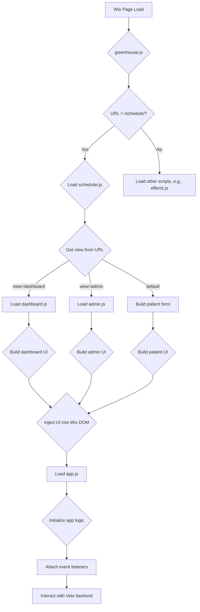

# Wix DOM Manipulation for Greenhouse Apps

This document outlines the architecture and process for injecting the Greenhouse scheduling application into the Greenhouse Mental Health Wix website.

## High-Level Architecture

The system is designed to embed a custom scheduling application, built with vanilla JavaScript, into a specific page on a Wix-built website. This is achieved through a process of dynamic script loading and direct DOM manipulation.

The architecture can be broken down into the following components:

1.  **Wix Website**: The host environment, built with Wix, which uses ReactJS to render pages.
2.  **Loader Script (`greenhouse.js`)**: A single script loaded on all pages of the Wix site that acts as an entry point.
3.  **Application Core (`scheduler.js`)**: The main script for the scheduling application.
4.  **View Scripts (`dashboard.js`, `admin.js`)**: Scripts that build the UI for specific views within the application.
5.  **Logic Script (`app.js`)**: A script that contains the business logic for the patient-facing form.
6.  **Wix Velo Backend**: Backend functions that provide data and services to the application.

## Process Flow

## File Descriptions

### `greenhouse.js` (Loader)

*   **Purpose**: To act as a lightweight loader for all Greenhouse applications.
*   **Functionality**:
    *   Loaded on every page of the Wix site.
    *   Checks the current URL to see if it matches the `/schedule/` page.
    *   If it's the schedule page, it determines which view to load based on the `view` URL parameter (defaulting to `dashboard`).
    *   It dynamically creates a `<script>` tag for `scheduler.js` and appends it to the DOM.
    *   It passes two crucial pieces of information to `scheduler.js` via `data-` attributes:
        *   `data-target-selector`: A complex CSS selector that points to the specific element in the Wix DOM where the application should be injected.
        *   `data-base-url`: The base URL for loading other application assets.

### `scheduler.js` (Application Core)

*   **Purpose**: To manage the rendering of the scheduling application.
*   **Functionality**:
    *   Reads the `target-selector` and `base-url` from its own script tag.
    *   Uses the `view` URL parameter to decide which view to render.
    *   Loads the necessary view script (`dashboard.js` or `admin.js`) or builds the patient form UI itself.
    *   Fetches the `schedule.css` stylesheet and injects it into the `<head>`.
    *   Clears the `innerHTML` of the target element and appends the new UI to it.
    *   Loads `app.js` to provide interactivity for the patient form.

### `dashboard.js`

*   **Purpose**: To build the UI for the main calendar/dashboard view.
*   **Functionality**:
    *   Creates the HTML for the calendar, schedule, and conflict resolution areas.
    *   Fetches appointment data from the Wix Velo backend.
    *   Exposes a `buildDashboardUI` function that is called by `scheduler.js`.

### `app.js`

*   **Purpose**: To provide the business logic for the patient appointment request form.
*   **Functionality**:
    *   Handles form submissions, user input, and validation.
    *   Communicates with the Wix Velo backend to create and update appointments.
    *   **Important**: This script is only intended to be used with the `patient` view and will cause errors if loaded with other views.

## Challenges of Wix DOM Manipulation

The primary challenge with this approach is that we are directly manipulating a DOM that is controlled by Wix's React-based rendering engine.

*   **DOM Instability**: React can re-render components at any time. If a parent of our injected application is re-rendered, our entire application will be removed from the DOM. This is the likely cause of the "disappearing schedule" issue.
*   **Complex Selectors**: Wix generates very long and specific CSS selectors. These can be brittle and may break if the Wix site structure is changed.
*   **Styling Conflicts**: The CSS from our application can conflict with the Wix site's styles, and vice-versa. This can lead to unexpected layout issues, like the "shift to the right".

## Recommendations

While the current system works, it is fragile. For a more robust and supportable solution, consider using **Wix Custom Elements**. This is the official, recommended way to embed custom applications in a Wix site.

By using a Custom Element, you are creating a self-contained component that Wix is aware of. Wix will manage the lifecycle of this component, ensuring that it is not accidentally removed from the DOM during a React re-render. This would eliminate the primary source of instability in the current system.

## Final Refinements and Decoupling

After further review, a final set of changes are being made to fully decouple the application components and ensure stability.

### The Change

The `scheduler.js` script is being modified to remove the conditional initialization of `AppointmentApp`. This logic was a remnant of a previous implementation and was the root cause of the "disappearing schedule" issue.

The `AppointmentApp` object, which is defined in `app.js`, is being renamed to `GreenhousePatientApp` to better reflect its purpose and to adhere to the new naming convention.

### Implementation Impact

This change will have the following positive impacts on the implementation:

*   **Decoupling:** `scheduler.js` will no longer have any direct knowledge of the internal logic of the patient form. It will simply be responsible for loading the correct view.
*   **Stability:** By removing the incorrect initialization of the patient form logic when the dashboard view is loaded, we eliminate the source of the errors that were causing the schedule to disappear.
*   **Clarity:** The new naming convention makes the purpose of each script clearer.

### Thorough Review

A thorough review of the entire workflow has been conducted to ensure that this change will not introduce any new problems.

*   **Dashboard View:** The dashboard view, which is the primary view for the schedule page, does not depend on the logic in `app.js`. Removing the initialization of `GreenhousePatientApp` will have no negative impact on the dashboard.
*   **Patient View:** The patient view, which is used for requesting appointments, *does* depend on the logic in `app.js`. To ensure that this view continues to function correctly, the initialization of `GreenhousePatientApp` will be moved into the `patient` view's rendering logic within `scheduler.js`. This ensures that the patient form is only initialized when it is actually being displayed.

### Normal Performance

With these changes, the javascripts will now perform as a cohesive and stable application:

*   **`greenhouse.js`**: Continues to act as the main loader.
*   **`scheduler.js`**: Acts as a true application core, loading the appropriate view and not concerning itself with the internal logic of those views.
*   **`dashboard.js`**: Provides the dashboard UI, which will now render without interference.
*   **`app.js` (as `GreenhousePatientApp`)**: Provides the logic for the patient form, and is only loaded and initialized when the patient view is active.

### Final Confirmation

This change represents a final refinement of the application's architecture. By decoupling the components and ensuring that logic is only loaded when needed, we have created a more robust and maintainable system. This should be the last change required to achieve a stable and functional scheduling application.